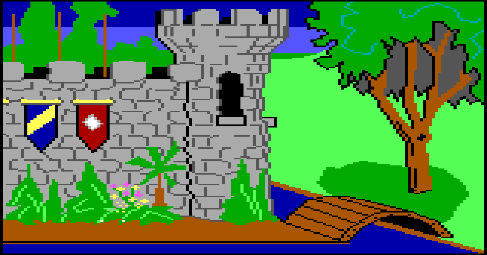
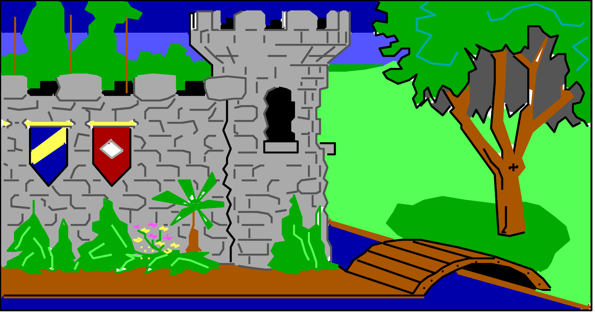
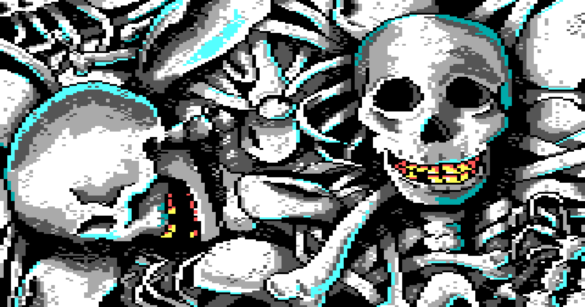
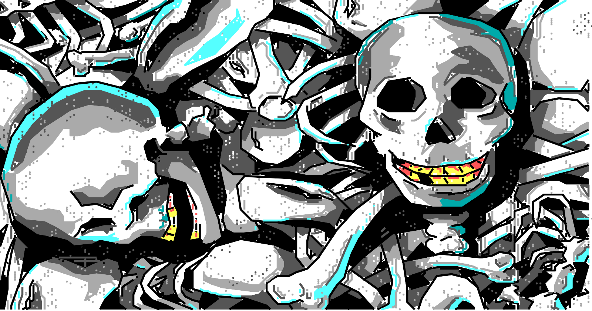
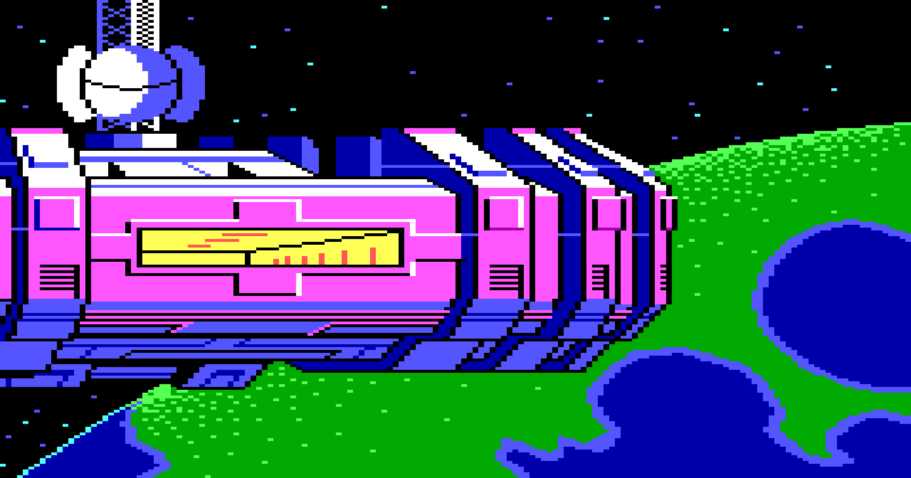
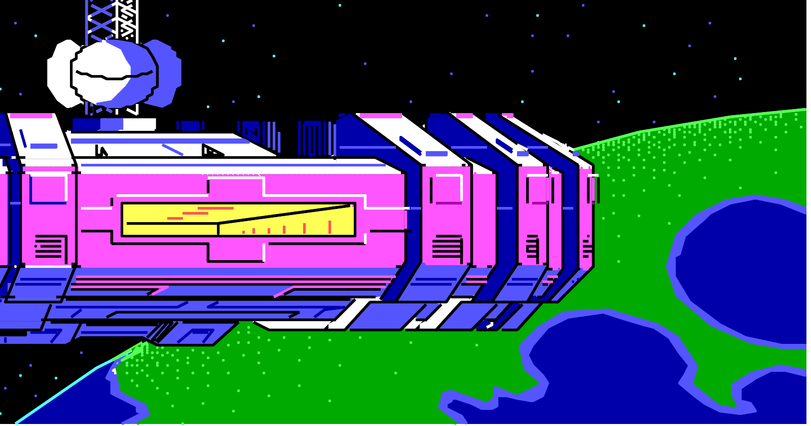

### agi-upscale

This is a tool written in Ruby to upscale old Sierra AGI game backgrounds.

### Examples

Before:


After:


Before:


After:


Before:


After:


### Installlation

1. Check out the repo

2. Make sure you have ImageMagick installed.

3. Run `bundle install` to install dependencies


### Usage

You need to supply it with a directory containing the DOS version of an AGI
Sierra game, and the id of the picture you want to upscale.

Example:

```
$ ruby pic.rb kq2 3 3.png
```

That will render pic 3 from kings quest 2 at an upscaled resolution.

If you want to extract all backgrounds from a game you can do this, assuming `output` is an 
empty subdirectory for the output images. 

```
$ ruby pic.rb kq2 all output
```

### Credits

Written by Robin Ward - aka @eviltrout

It would have been impossible with the [ScummVM](https://www.scummvm.org/) technical documentation
and codebase as a reference.
